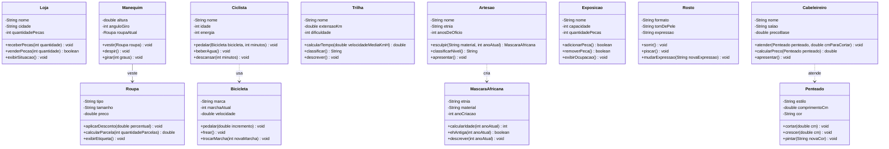

# Diagrama UML - Atividade 2

Classes das 4 imagens (Loja, Trilha, Máscaras africanas e Penteados).

```mermaid
classDiagram
    %% ===== Imagem 1 =====
    class Loja {
        -String nome
        -String cidade
        -int quantidadePecas
        +receberPecas(int quantidade) void
        +venderPecas(int quantidade) boolean
        +exibirSituacao() void
    }
    class Roupa {
        -String tipo
        -String tamanho
        -double preco
        +aplicarDesconto(double percentual) void
        +calcularParcela(int quantidadeParcelas) double
        +exibirEtiqueta() void
    }
    class Manequim {
        -double altura
        -int anguloGiro
        -Roupa roupaAtual
        +vestir(Roupa roupa) void
        +despir() void
        +girar(int graus) void
    }
    %% ===== Imagem 2 =====
    class Bicicleta {
        -String marca
        -int marchaAtual
        -double velocidade
        +pedalar(double incremento) void
        +frear() void
        +trocarMarcha(int novaMarcha) void
    }
    class Ciclista {
        -String nome
        -int idade
        -int energia
        +pedalar(Bicicleta bicicleta, int minutos) void
        +beberAgua() void
        +descansar(int minutos) void
    }
    class Trilha {
        -String nome
        -double extensaoKm
        -int dificuldade
        +calcularTempo(double velocidadeMediaKmH) double
        +classificar() String
        +descrever() void
    }
    %% ===== Imagem 3 =====
    class MascaraAfricana {
        -String etnia
        -String material
        -int anoCriacao
        +calcularIdade(int anoAtual) int
        +ehAntiga(int anoAtual) boolean
        +descrever(int anoAtual) void
    }
    class Artesao {
        -String nome
        -String etnia
        -int anosDeOficio
        +esculpir(String material, int anoAtual) MascaraAfricana
        +classificarNivel() String
        +apresentar() void
    }
    class Exposicao {
        -String nome
        -int capacidade
        -int quantidadePecas
        +adicionarPeca() boolean
        +removerPeca() boolean
        +exibirOcupacao() void
    }
    %% ===== Imagem 4 =====
    class Penteado {
        -String estilo
        -double comprimentoCm
        -String cor
        +cortar(double cm) void
        +crescer(double cm) void
        +pintar(String novaCor) void
    }
    class Rosto {
        -String formato
        -String tomDePele
        -String expressao
        +sorrir() void
        +piscar() void
        +mudarExpressao(String novaExpressao) void
    }
    class Cabeleireiro {
        -String nome
        -String salao
        -double precoBase
        +atender(Penteado penteado, double cmParaCortar) void
        +calcularPreco(Penteado penteado) double
        +apresentar() void
    }

    %% ===== Relações =====
    Manequim --> Roupa : veste
    Ciclista ..> Bicicleta : usa
    Artesao ..> MascaraAfricana : cria
    Cabeleireiro ..> Penteado : atende
```
